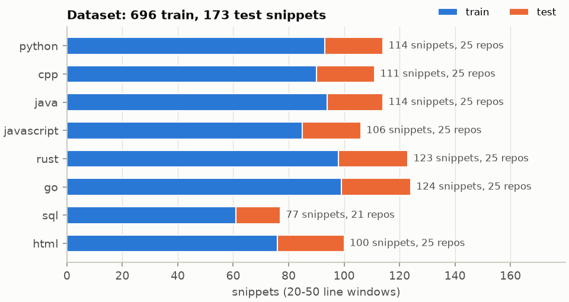
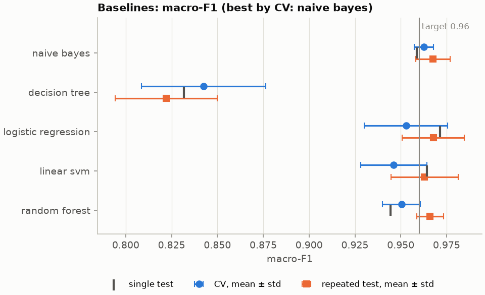
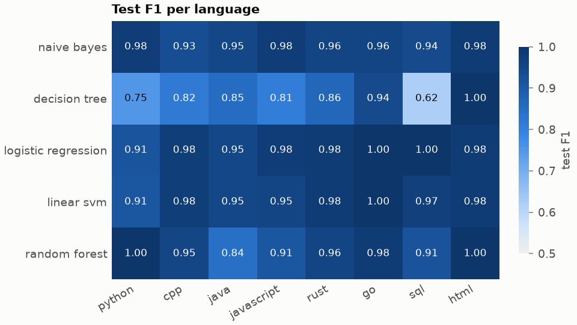
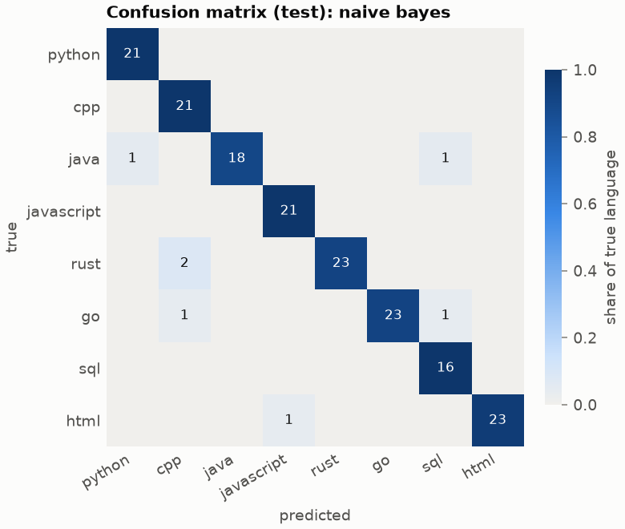
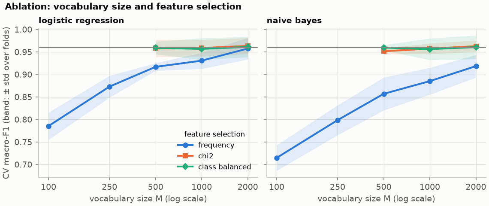
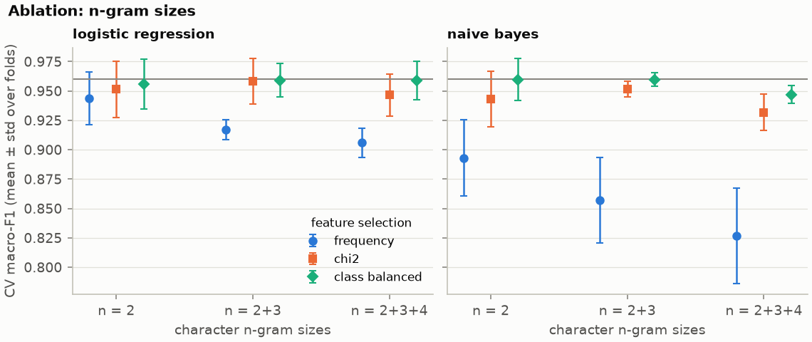
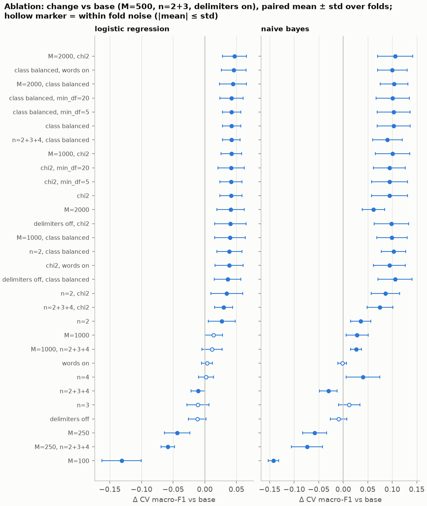
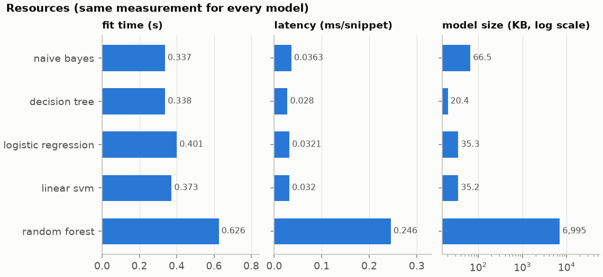
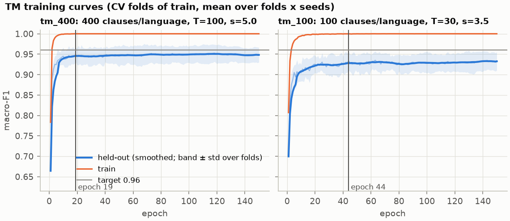
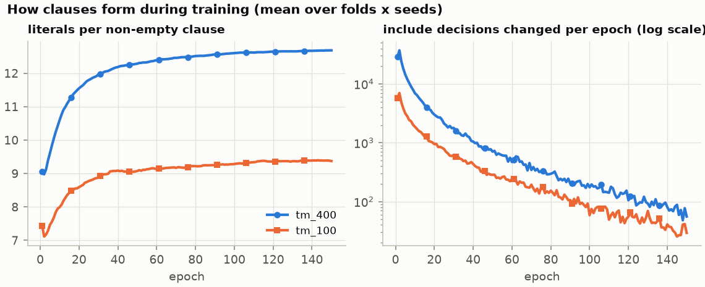

# CodeLangTM report

A readable account of the project so far: what we are building, the data, how models are evaluated, what the classical baselines achieve, which feature choices mattered, and what the Tsetlin Machine (TM) has to match.

New to the terms used here (clauses, T and s, macro-F1, CV, ablation)? See the [concepts guide](concepts.md).

*Hand-written narrative.* The exact numbers live in generated files ([results.md](results.md), [ablations.md](ablations.md) and their `.json` twins). The figures are regenerated with `uv run codelangtm report`. Last updated 2026-09-27 (dataset v5, frozen features, before any TM training).

**Contents:** [1 Goal](#1-goal-and-approach) · [2 Data](#2-data) · [3 Evaluation](#3-how-models-are-evaluated) · [4 Baselines](#4-baselines-the-bar-for-the-tm) · [5 Feature ablations](#5-feature-ablations-what-mattered) · [6 Resources](#6-resources) · [7 Tsetlin Machine](#7-tsetlin-machine) · [8 Limitations](#8-limitations) · [9 Reproduce](#9-reproduce)

## 1. Goal and approach

Given a snippet of source code, say which of 8 languages it is written in (Python, C++, Java, JavaScript, Rust, Go, SQL, HTML), and be able to explain *why*.

Most classifiers learn numeric weights that are hard to read. A **Tsetlin Machine** instead learns **clauses**: AND-rules over yes/no features, such as

```
python  <-  has("def ") AND has(":") AND NOT has(";")
```

Each language has a set of clauses. Some vote *for* the language and some vote *against* it; the language with the most net votes wins. Because the rules are plain logic, every prediction can be traced to the clauses that fired. The same logic also makes the model small and fast (bitwise operations instead of matrix arithmetic).

**Pipeline:** snippet → binary features ("does the snippet contain this 2- or 3-character string?") → TM clauses → votes per language → prediction.

Targets, reported as measured: macro-F1 ≥ 0.96, < 0.1 ms per snippet, < 500 KB model.

## 2. Data



- **869 snippets** of real code from **196 permissively licensed GitHub repositories** (MIT, Apache-2.0, BSD). There is no synthetic code, because generated snippets lack the messiness of real code.
- Each snippet is one contiguous **20-50 line window** from one file. There is at most one window per file and at most 5 per repository, so no single project dominates a language.
- Labels come from the file extension and are cross-checked against the content. Checks drop minified or binary files, template-heavy SQL/HTML, and HTML windows that are mostly embedded JavaScript. Windows never start or end inside a comment or string. Manual review of 80 samples found no mislabels.
- **SQL is the smallest class** (77 snippets, 21 repos): permissively licensed SQL repositories are rare.

Full details, limitations and file hashes: [dataset card](dataset-card.md).

## 3. How models are evaluated

The main risk in this task is **leakage**. Code from the same repository shares names, style and comments, so a model tested on a repository it was trained on looks better than it really is.

- **Split by repository.** Each language's repositories are split 80/20 into train and test, so no repository appears on both sides. The split is a stable hash, so adding or re-collecting one language never moves another language's test repositories ([issues-and-fixes M4](issues-and-fixes.md)).
- **Model and feature choices use cross-validation (CV) on train only.** Train is cut into 5 folds, again by repository. Each fold is held out once while the model trains on the other four. The **CV score** is the mean ± std over the 5 folds. Everything learned from data, including the feature vocabulary, is refit inside each fold, so the held-out fold never influences its own features ([M1](issues-and-fixes.md)).
- **The test set is scored once per model** and never used to choose anything.
- **Repeated test.** With only 39 test repositories, one test score depends a lot on *which* repositories landed in test: on v4, ten different splits gave anywhere from 0.870 to 0.978. So each model is also scored on 10 further repository splits, reported as mean ± std.
- **Metric: macro-F1.** F1 is computed for each language, then averaged, so the small SQL class counts as much as the others.

## 4. Baselines: the bar for the TM

Five standard classifiers were trained on exactly the features the TM will use: Naive Bayes, decision tree, logistic regression, linear SVM and random forest.



| Model | CV macro-F1 | Test | Repeated test |
| --- | --- | --- | --- |
| **Naive Bayes** (best by CV) | 0.963 ± 0.005 | 0.959 | 0.968 ± 0.009 |
| Logistic regression | 0.953 ± 0.023 | 0.971 | 0.968 ± 0.017 |
| Random forest | 0.950 ± 0.010 | 0.944 | 0.966 ± 0.007 |
| Linear SVM | 0.946 ± 0.018 | 0.964 | 0.963 ± 0.018 |
| Decision tree | 0.843 ± 0.034 | 0.832 | 0.822 ± 0.028 |

What this shows:

- **The 0.96 target is reachable with simple models.** The TM has to match about 0.96-0.97. Its case then rests on interpretability, size and speed, not on beating the baselines by a wide margin.
- **Single test scores are noisy.** Logistic regression's single test score (0.971) is above its CV score (0.953), while its repeated test sits in between. CV and repeated test are the numbers to trust.
- **The decision tree is far behind.** One tree must split on one feature at a time, and SQL is its worst language (F1 0.62).





Naive Bayes gets 166 of 173 test snippets right. Its 7 mistakes are all single or double confusions:

- **Rust → C++ (2) and Go → C++ (1).** C++ and Rust were already the main confusable pair in the first baselines; they share `::`, `->` and braces.
- **Java → SQL and Go → SQL (1 each).**
- **HTML → JavaScript (1).**
- **Java → Python (1).**

The individual snippets have not been reviewed yet. The M3 error analysis will look at them, and check whether the TM's rules explain the confusable pairs.

## 5. Feature ablations: what mattered

An *ablation* changes one feature option at a time and measures the effect with CV (train only, never test). Each option is compared with a base setting **on the same folds**. The paired difference (Δ) cancels out how hard each fold is. A change counts as real only when its mean Δ is larger than its std across folds.

The features are yes/no flags: "does the snippet contain this character n-gram?" (an n-gram is a string of n characters, e.g. `def` or `::`). Only M of them are kept (the *vocabulary*). The question is which M.

**Finding 1: how the vocabulary is chosen matters most.** The original rule kept the M most *frequent* n-grams across all languages. Frequent is not the same as useful: slots went to strings like `ing` and `ion` that appear in English comments in every language. *Label-aware* selection instead picks n-grams that separate languages:

- `chi2`: a statistical test of association with the language;
- `class_balanced`: languages take turns picking their most distinctive n-gram.



At M=500, label-aware selection lifts logistic regression from 0.917 to 0.959 and Naive Bayes from 0.857 to 0.960 ([issues-and-fixes M6](issues-and-fixes.md)). SQL gains the most (0.87 → 0.99): its first picks become `SEL`, `ELE` and `ECT`, pieces of `SELECT` that frequency ranking had pushed out. With frequency ranking, logistic regression needs M=2000 to catch up (0.958), and Naive Bayes does not catch up in the range tested (0.919 at M=2000).

**Finding 2: once selection is label-aware, the other options barely matter.**





- **Vocabulary size:** M=1000 or 2000 adds at most about 0.01, within noise.
- **n-gram sizes:** bigrams only, 2+3 and 2+3+4 differ by at most 0.02, within fold noise.
- **Word tokens** (whole keywords such as `SELECT`, `fn`): no gain, and slower (0.14 vs 0.11 ms per snippet).
- **Structural delimiters** (`;`, `{`, `->`, indentation): no gain, and they cost most of the binarization time. With them off, binarization takes about 0.03 ms instead of about 0.11 ms per snippet.

**Frozen feature configuration for the TM** (`configs/baselines.yaml`): `class_balanced` selection, M=500, 2- and 3-character n-grams, no delimiters, no word tokens. This choice is at the top of the noise band, gives every language its own features (cleaner rules to read later), and keeps the TM's input small.

## 6. Resources

Every model is measured the same way, so the TM will simply be one more row.



- **Most models are small and fast.** They fit in under 0.5 s and predict in about 0.03 ms per snippet, end to end (feature extraction + prediction). Random forest is the exception: 7 MB and about 0.25 ms per snippet.
- **Feature extraction, not the classifier, dominates.** Building the binary features used 72 MB of peak memory, against ≤ 4.3 MB for any classifier. It also takes most of the prediction time. A rewrite made it 5-6× faster with identical output ([M2](issues-and-fixes.md)).
- **Timings are approximate.** On this machine, timings vary by about ±50% with background load. The < 0.1 ms target is confirmed only by the dedicated benchmark planned for M6.
- **Memory measurement is incomplete for C code.** Memory is traced for Python/NumPy allocations only, so memory used inside C libraries is not seen. M3 adds a process-level measurement for all models, the TM included.

## 7. Tsetlin Machine

*The full comparison with the baselines (test set, repeated splits, significance test) comes next in M3.* So far, all on CV folds of train (the test set has not been used for the TM):

**Training curves.** Each TM setting was trained on the 5 folds with 5 seeds each (25 runs), for up to 150 epochs, scoring the held-out fold after every epoch ([tm-curves.md](tm-curves.md)).



| TM setting | Epochs chosen | Held-out macro-F1 there | Best smoothed (epoch) | Naive Bayes, same folds |
| --- | --- | --- | --- | --- |
| 400 clauses per language, T=100, s=5 | 19 | 0.946 | 0.951 (120) | 0.963 |
| 100 clauses per language, T=30, s=3.5 | 44 | 0.928 | 0.933 (142) | 0.963 |

- **Learning is fast, then flat.** The TM gets 99% of the training set right within 5 epochs, and the held-out score stops improving after about 20 epochs (400 clauses). Training longer adds at most 0.005, so the chosen epoch is the first point where the smoothed curve levels off, not the best single epoch, which would be partly luck.
- **The TM trails Naive Bayes by about 1.5 points** (0.946-0.951 vs 0.963), and the training score of 1.000 against about 0.95 held out shows it fits the training data completely. This is the honest starting point for tuning in M4.
- **One lucky seed misled the first experiment.** The throwaway spike (B1) measured 0.962 with seed 42, and chose the 400-clause setting on that basis. Averaged over seeds 1-5 the same setting gives 0.945-0.950 per seed; rerunning seed 42 with the final code reproduces 0.962, so the code is consistent and seed 42 was simply lucky (one fold scored 0.991). This is why every TM number is now a mean over 5 seeds ([issues-and-fixes M8](issues-and-fixes.md)).
- **Clauses grow, then settle.** During training, clauses get longer (about 9 → 12.7 literals per clause with 400 clauses) and change less and less: from about 29,000 include decisions changing in the first epoch to under 100 per epoch near epoch 150.



- **Training is cheap:** one epoch (one pass over about 550 snippets) takes 0.03-0.05 s.
- **Prediction can run without TMU.** A plain NumPy re-implementation gives exactly the same scores as TMU, and ran about twice as fast in a first measurement (0.03 vs 0.07 ms per snippet, one fold). A trained model is saved as one JSON file of about 160 KB and can be used and inspected without TMU installed.

Planned content:

- **Comparison:** TM vs the baselines on the same folds, the same test set and the same 10 repeated splits, each TM number a mean over 5 seeds, with a corrected resampled t-test against Naive Bayes. Two TM sizes: 400 clauses per language (19 epochs) and the planned 100 (44 epochs, reference).
- **Resources:** size (including the bit-packed clause size used by the C export), latency and memory.
- **How the TM works inside:**
  - every learned clause, readable as a rule;
  - the signature features of each language;
  - which languages share literals, to explain confusable pairs;
  - how clauses form over epochs;
  - one prediction traced to the exact clauses that fired.

## 8. Limitations

- **Snippet length:** only 20-50 line windows. Accuracy on one-line or very short snippets is not measured; this is a Future item in the [roadmap](roadmap.md).
- **Small dataset:** 869 snippets and 8 languages. Test scores move by several points depending on which repositories are in test, which is why CV and repeated test are reported.
- **Missing test sets and languages:** there is no "wild" test set yet (code from StackOverflow, blogs and docs), and stretch languages such as TypeScript and C# are deferred to Stage B.
- **Labels are not hand-annotated.** They come from file extensions plus content checks. Checks and reviews found no mislabels, but some hard cases remain (for example, Rust code that mirrors C structures).
- **Unstable timings:** timings come from a single, busy machine.

## 9. Reproduce

```bash
uv sync --extra tm --extra collect --extra viz
uv run codelangtm collect github                                   # needs GITHUB_TOKEN; data/raw/
uv run codelangtm data build                                       # data/processed/ (dataset v5)
uv run codelangtm baselines --config configs/baselines.yaml        # docs/results.md + .json
uv run codelangtm ablate                                           # docs/ablations.md + .json
uv run codelangtm report                                           # docs/figures/*.png
```

The data is not committed (`data/` is gitignored). Collection is recorded in [data-sources.md](data-sources.md), and dataset hashes are listed in the [dataset card](dataset-card.md) and in the header of every generated report.
