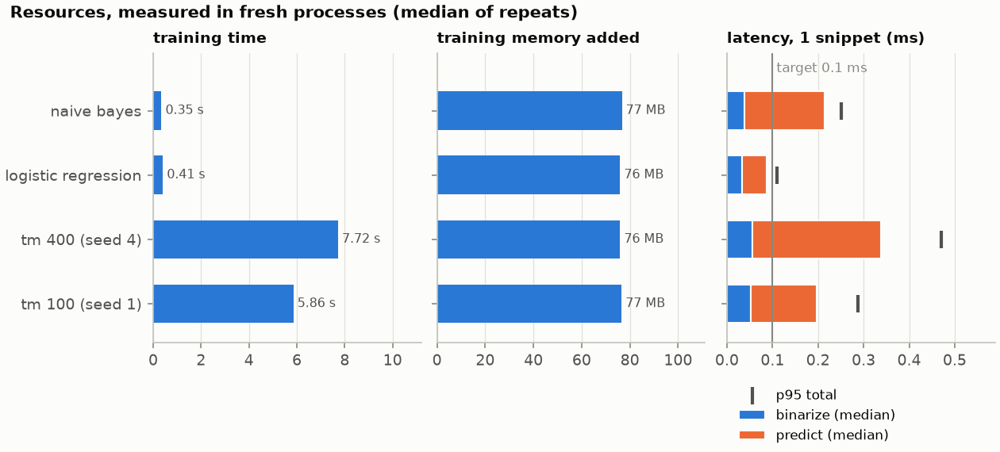

# Resources (process level)

Generated by `codelangtm resources`; do not edit by hand. Re-run to refresh.

## Setup

- Generated: 2026-09-28 12:51:21; config hash `79462a690bf6`; dataset train 696, test 173
- Every number comes from a fresh Python process doing one job; each job ran 3 times and the median is shown. Memory: peak working set (Windows), which includes memory allocated in C extensions (TMU, liblinear).
- **Training:** load the data, then fit binarizer + classifier on all of train. *Added* = peak process memory during training minus the memory before it (after imports and data loading).
- **Prediction:** load the saved model (TM: the JSON model file, NumPy only, no TMU; baselines: the pickled pipeline), then classify each of the 173 test snippets one at a time, 3 passes; binarize and predict timed separately (median and 95th percentile per snippet); plus one batch pass.
- Versions: python 3.12.12, scikit-learn 1.9.1, numpy 1.26.4; CPU: Intel64 Family 6 Model 183 Stepping 1, GenuineIntel; platform win32

## Training

| Model | Wall (s) | CPU (s) | Memory before (MB) | Peak (MB) | Added by training (MB) |
| --- | --- | --- | --- | --- | --- |
| naive_bayes | 0.35 | 0.34 | 137 | 214 | 77 |
| logistic_regression | 0.41 | 0.58 | 137 | 213 | 76 |
| tm_400 (seed 4) | 7.72 | 7.62 | 138 | 214 | 76 |
| tm_100 (seed 1) | 5.86 | 5.84 | 138 | 215 | 77 |

## Prediction, one snippet at a time

| Model | Model file (KB) | Load (s) | Binarize ms (median / p95) | Predict ms (median / p95) | Total ms (median / p95) | Batch ms/snippet | Peak memory (MB) |
| --- | --- | --- | --- | --- | --- | --- | --- |
| naive_bayes | 67 (pickled pipeline) | 0.74 | 0.039 / 0.054 | 0.175 / 0.206 | 0.215 / 0.251 | 0.039 | 137 |
| logistic_regression | 35 (pickled pipeline) | 0.74 | 0.033 / 0.048 | 0.055 / 0.066 | 0.089 / 0.109 | 0.031 | 136 |
| tm_400 (seed 4) | 164 (TM model file (JSON)) | 0.79 | 0.056 / 0.082 | 0.283 / 0.400 | 0.343 / 0.471 | 0.057 | 154 |
| tm_100 (seed 1) | 33 (TM model file (JSON)) | 0.84 | 0.052 / 0.082 | 0.145 / 0.213 | 0.199 / 0.288 | 0.039 | 140 |

