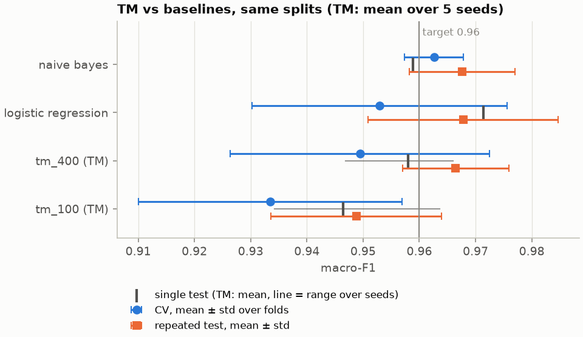
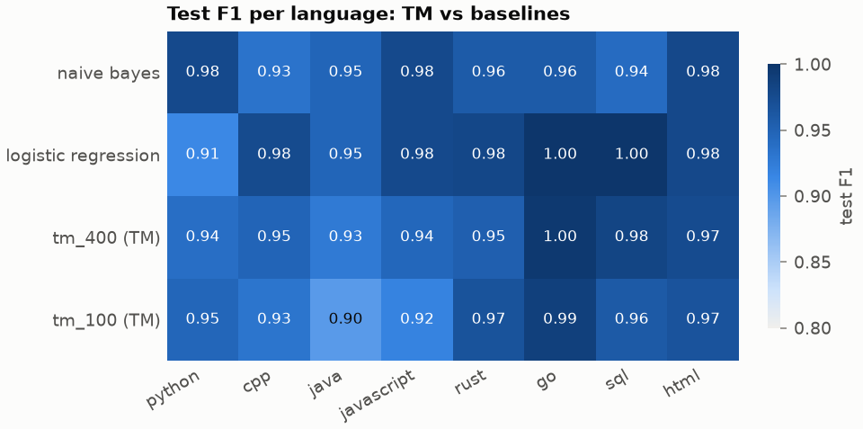

# TM results

Generated by `codelangtm tm-results`; do not edit by hand. Re-run to refresh.

## Setup

- Generated: 2026-09-28 05:24:29; config `configs/tm.yaml` (settings hash `79462a690bf6`)
- Dataset: `data/processed` (train 696, test 173); SHA-256 prefixes: `train.jsonl` 8cdc4c91ebe6, `test.jsonl` 54649be8e4e0, `wild.jsonl` e3b0c44298fc, `folds.json` 77229e0f7668
- Protocol (identical code for every model, `baselines.evaluate_model`): 5-fold repo-grouped CV on train; one fit on all of train scored once on test; 10 repeated balanced repo-level splits of train + test. Binarizer refit inside every fit.
- TM: every setting runs once per seed (1, 2, 3, 4, 5); TM rows are means over seeds. Epoch counts come from the training curves ([tm-curves.md](tm-curves.md)), chosen on CV only.
- Significance: TM minus baseline per fold / per split (TM averaged over seeds), corrected resampled t-test (Nadeau & Bengio 2003), two-sided, 95% interval; test/train ratio 0.250 for CV folds, 0.244 for the repeated splits.
- Versions: python 3.12.12, scikit-learn 1.9.1, numpy 1.26.4, tmu 0.8.3; CPU: Intel64 Family 6 Model 183 Stepping 1, GenuineIntel

## Accuracy

Baselines: mean ± std over folds (CV) and over splits (repeated test), as in [results.md](results.md). TM: the same, averaged over seeds, plus the spread over seeds.

| Model | CV macro-F1 | Test macro-F1 | Repeated test macro-F1 | Test accuracy | Seed spread (std: CV / test / repeated) |
| --- | --- | --- | --- | --- | --- |
| naive_bayes | 0.963 ± 0.005 | 0.959 | 0.968 ± 0.009 | 0.960 | - |
| logistic_regression | 0.953 ± 0.023 | 0.971 | 0.968 ± 0.017 | 0.971 | - |
| **tm_400** (400 clauses, 120 epochs) | 0.949 ± 0.023 | 0.958 (0.947-0.966) | 0.966 ± 0.009 | 0.958 | 0.002 / 0.007 / 0.004 |
| **tm_100** (100 clauses, 142 epochs) | 0.933 ± 0.023 | 0.946 (0.934-0.964) | 0.949 ± 0.015 | 0.948 | 0.009 / 0.011 / 0.001 |

## Significance: TM minus baseline

Positive Δ means the TM scores higher. p < 0.05 with an interval that excludes 0 means the difference is unlikely to be split-to-split chance.

| TM | Baseline | Evaluation | Mean Δ macro-F1 | 95% interval | t | p | Splits |
| --- | --- | --- | --- | --- | --- | --- | --- |
| tm_400 | naive_bayes | CV folds | -0.013 | -0.056 to +0.030 | -0.85 | 0.441 | 5 |
| tm_400 | naive_bayes | repeated test splits | -0.001 | -0.012 to +0.010 | -0.23 | 0.823 | 10 |
| tm_400 | logistic_regression | CV folds | -0.003 | -0.018 to +0.011 | -0.64 | 0.558 | 5 |
| tm_400 | logistic_regression | repeated test splits | -0.001 | -0.021 to +0.019 | -0.15 | 0.884 | 10 |
| tm_100 | naive_bayes | CV folds | -0.029 | -0.072 to +0.014 | -1.89 | 0.131 | 5 |
| tm_100 | naive_bayes | repeated test splits | -0.019 | -0.043 to +0.006 | -1.73 | 0.117 | 10 |
| tm_100 | logistic_regression | CV folds | -0.019 | -0.040 to +0.001 | -2.61 | 0.059 | 5 |
| tm_100 | logistic_regression | repeated test splits | -0.019 | -0.034 to -0.004 | -2.96 | 0.016 | 10 |

## Test F1 per language

| Model | python | cpp | java | javascript | rust | go | sql | html |
| --- | --- | --- | --- | --- | --- | --- | --- | --- |
| naive_bayes | 0.98 | 0.93 | 0.95 | 0.98 | 0.96 | 0.96 | 0.94 | 0.98 |
| logistic_regression | 0.91 | 0.98 | 0.95 | 0.98 | 0.98 | 1.00 | 1.00 | 0.98 |
| tm_400 (mean of seeds) | 0.94 | 0.95 | 0.93 | 0.94 | 0.95 | 1.00 | 0.98 | 0.97 |
| tm_100 (mean of seeds) | 0.95 | 0.93 | 0.90 | 0.92 | 0.97 | 0.99 | 0.96 | 0.97 |

## Confusion matrix: tm_400 (test, summed over 5 seeds)

Rows are true languages, columns predicted; each seed classifies the 173 test snippets once.

| true \ pred | python | cpp | java | javascript | rust | go | sql | html |
| --- | --- | --- | --- | --- | --- | --- | --- | --- |
| python | 105 | 0 | 0 | 0 | 0 | 0 | 0 | 0 |
| cpp | 3 | 99 | 2 | 1 | 0 | 0 | 0 | 0 |
| java | 8 | 0 | 89 | 1 | 0 | 0 | 2 | 0 |
| javascript | 0 | 0 | 1 | 103 | 0 | 0 | 0 | 1 |
| rust | 3 | 5 | 0 | 3 | 114 | 0 | 0 | 0 |
| go | 0 | 0 | 0 | 0 | 0 | 124 | 1 | 0 |
| sql | 0 | 0 | 0 | 0 | 0 | 0 | 80 | 0 |
| html | 0 | 0 | 0 | 5 | 0 | 0 | 0 | 115 |

## Confusion matrix: tm_100 (test, summed over 5 seeds)

Rows are true languages, columns predicted; each seed classifies the 173 test snippets once.

| true \ pred | python | cpp | java | javascript | rust | go | sql | html |
| --- | --- | --- | --- | --- | --- | --- | --- | --- |
| python | 105 | 0 | 0 | 0 | 0 | 0 | 0 | 0 |
| cpp | 1 | 95 | 4 | 3 | 0 | 0 | 2 | 0 |
| java | 7 | 1 | 86 | 3 | 0 | 0 | 3 | 0 |
| javascript | 0 | 0 | 2 | 100 | 0 | 0 | 0 | 3 |
| rust | 4 | 3 | 0 | 1 | 117 | 0 | 0 | 0 |
| go | 0 | 0 | 0 | 1 | 0 | 122 | 2 | 0 |
| sql | 0 | 0 | 0 | 0 | 0 | 0 | 80 | 0 |
| html | 0 | 0 | 0 | 5 | 0 | 0 | 0 | 115 |

## Model size and speed

Latency is end to end (binarize + predict with the NumPy `TMState`), median of passes over the test set; TMU latency is TMU's own `predict` on already-binarized input. Model JSON is the one-file model format (`codelangtm.tm/1`, compact). Timings on this machine vary with background load; B5 measures resources in isolated processes.

| TM | Clauses | Included literals (per clause) | Empty clauses | Model JSON (KB) | Pickled (KB) | Fit wall / CPU (s) | Latency (ms/snippet) | TMU predict (ms/snippet) |
| --- | --- | --- | --- | --- | --- | --- | --- | --- |
| tm_400 | 3,200 | 38,201 (12.1) | 45 | 166 | 204 | 7.7 / 7.5 | 0.081 | 0.131 |
| tm_100 | 800 | 6,779 (8.7) | 24 | 34 | 43 | 7.0 / 6.9 | 0.060 | 0.096 |

Baselines in the same run: naive_bayes 0.038 ms, 67 KB; logistic_regression 0.031 ms, 35 KB.

Final models (one per seed, trained on all of train) saved locally, not committed: `models/tm_400_seed1.json`, `models/tm_400_seed2.json`, `models/tm_400_seed3.json`, `models/tm_400_seed4.json`, `models/tm_400_seed5.json`, `models/tm_100_seed1.json`, `models/tm_100_seed2.json`, `models/tm_100_seed3.json`, `models/tm_100_seed4.json`, `models/tm_100_seed5.json`.
